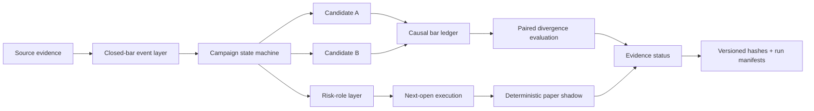

# RT Multi-Timeframe Quant Research

[](https://github.com/tangyunkai-hub/rt-multitimeframe-quant-research/actions/workflows/ci.yml)


A public-safe quantitative-research portfolio showing how a discretionary multi-timeframe Bitcoin framework was converted into a **causal, versioned, testable, and auditable research system**.

> **Current conclusion:** the frozen holdout failed. A separately frozen 2017–2022 external historical program produced heterogeneous evidence—BTC adverse to Candidate B, ETH supportive—and the same split persisted when execution/PnL moved from Binance to Coinbase. Candidate B therefore remains a prospective hypothesis, not validated alpha.

## Why this project matters

The project is intentionally not presented as “a strategy with a high historical Sharpe.” Its main value is the research process:

**formalize → test invariants → diagnose concentration → freeze candidate → fail holdout → preserve failure → attribute mechanism → make one minimal change → embargo consumed data → preregister external and prospective validation → preserve contradictory evidence → harden reproducibility and paper audit**

The retrospective development path looked strong, but the frozen holdout did not generalize:

| Evidence | Result |
|---|---:|
| Retrospective development return | **+257.9%** |
| Retrospective Sharpe | **~2.01** |
| Frozen holdout return | **-21.61%** |
| Frozen holdout Sharpe | **-1.15** |
| Frozen holdout max drawdown | **-38.02%** |
| External history BTC 2017–2022 | **Adverse to Candidate B** |
| External history ETH 2017–2022 | **Supportive of Candidate B** |
| Coinbase cross-exchange replication | **Same BTC/ETH directional split** |

The negative and contradictory results are retained instead of being tuned away.

## Research architecture



Key design choices:

- confirmed higher-timeframe direction persists until an opposite confirmed event;
- local contrary evidence can degrade risk state without silently reversing direction;
- Long and Short permissions are not forced into mathematical symmetry;
- signals become actionable only after their source bars close;
- next-open execution is separated from signal generation;
- strategy permissions, risk sizing, execution, and paper operation are separate research layers.

## Five-minute code-review path

If you are reviewing this as a quant researcher, engineer, or hiring manager, start here:

1. **State-machine design** — [`src/rtquant/core/`](src/rtquant/core/)
2. **Prospective A/B evaluation** — [`src/rtquant/validation/`](src/rtquant/validation/)
3. **Causal execution** — [`src/rtquant/execution/`](src/rtquant/execution/)
4. **Deterministic paper shadow + audit journal** — [`src/rtquant/paper/`](src/rtquant/paper/)
5. **Reproducibility / SHA-256 manifests** — [`src/rtquant/repro/`](src/rtquant/repro/)
6. **Tests** — [`tests/`](tests/)
7. **Research status and unresolved gates** — [`docs/research_status.md`](docs/research_status.md)
8. **External historical validation result** — [`research/external_validation_results_2017_2022_2026-09-12.md`](research/external_validation_results_2017_2022_2026-09-12.md)
9. **Cross-exchange execution result** — [`research/cross_exchange_execution_results_2017_2022_2026-09-12.md`](research/cross_exchange_execution_results_2017_2022_2026-09-12.md)
10. **Technical paper** — [`research/RT_Quant_Research_Public_Technical_Paper.md`](research/RT_Quant_Research_Public_Technical_Paper.md)

For a recruiter-oriented summary, see [`docs/recruiter_guide.md`](docs/recruiter_guide.md).

## Evidence timeline

| Stage | Purpose | Status |
|---|---|---|
| Development | Rule formalization + retrospective diagnostics | Complete |
| Robustness | Temporal, campaign, parameter, cost, delay stress | Mixed |
| Frozen holdout | Test unchanged candidate | **FAIL** |
| Failure attribution | Explain failure without rescue tuning | Complete |
| Candidate B | One minimal permission change | Frozen, unvalidated |
| External history 2017–2022 | Older-regime BTC test + ETH cross-asset replication | **Complete; heterogeneous** |
| Cross-exchange execution | Revalue frozen states on Coinbase | **Complete; venue-consistent** |
| Prospective validation | New-data-only A/B comparison | Waiting for evidence |
| Long validation | Sparse-trend replication across Bull epochs | Protocol frozen |
| Risk sizing | Fixed defensive benchmark policies | Unvalidated |
| Execution | Next-open causal simulator + fixed slippage stress | Built; historical stress exercised |
| Paper shadow | Hash-chained deterministic brokerless replay | **Engineering hardened, not live** |
| Reproducibility | Collision-safe manifests + byte verification | **Hardened** |

## Candidate B — what changed

Candidate B changes exactly one public-facing permission concept: after a local Short structural invalidation, the same-level re-entry signal inside the same continuous Major Bear epoch is treated as **probe/diagnostic only** rather than automatically restoring core Short exposure.

What did **not** change:

- the higher-timeframe persistence rule;
- initial Short permission;
- Long permissions;
- higher-authority Long recovery logic;
- frozen indicator thresholds;
- stop thresholds;
- risk-allocation fractions;
- base transaction-cost convention.

Historical ablation is diagnosis only. The 2017–2022 external program and Coinbase execution replication are explicitly retrospective robustness evidence, not prospective confirmation. Candidate B must still be judged on genuinely new data after its freeze boundary.

## External historical + cross-exchange robustness

The external evaluation protocol was frozen before reading 2017–2022 Candidate A/B performance. The primary test uses core exposure, next-observed-open fills, 14bp round-trip cost, paired divergence segments, and continuous Major Bear episodes as the independent replication unit.

- **BTC:** 26 divergence segments across 3 Bear divergence epochs; total paired delta log ≈ **-0.1701**; 1/3 epochs favor Candidate B; `ADVERSE_EXTERNAL_MECHANISM_EVIDENCE`.
- **ETH:** 20 divergence segments across 4 Bear divergence epochs; total paired delta log ≈ **+0.1482**; 3/4 epochs favor Candidate B; `EXTERNAL_MECHANISM_SUPPORT`.
- Fixed **0/2/5bp one-way slippage** stress does not change either qualitative label.
- Independent-epoch counts remain small, so no conventional statistical-significance claim is made.

A second preregistered test held the frozen A/B state paths constant and moved only execution/PnL to Coinbase. BTC remained adverse and ETH remained supportive; segment and Bear-epoch signs matched across venues for both assets. This makes the heterogeneity **execution-venue robust**, but still not validated alpha.

## Prospective validation gate

Candidate B is not eligible for formal prospective judgement before all three conditions are met:

- at least **180 forward days**;
- at least **3 independent Major Bear divergence epochs**;
- at least **6 A/B divergence segments**.

The primary mechanism statistic is paired incremental log-return over intervals where Candidate A and B actually differ. Multiple re-entry attempts inside one continuous Bear epoch are not counted as independent replications.

## Paper-shadow and reproducibility safeguards

The brokerless paper layer has no live order route. Its audit journal is append-only and SHA-256 chained, supports deterministic restart recovery, treats identical retries as idempotent no-ops, and hard-fails when an already processed timestamp arrives with changed data. Journal tampering and stale-state continuation are detected.

Run manifests reject ambiguous duplicate keys and verify both the manifest self-hash and the exact current input bytes. CI exercises the repository on Python **3.10, 3.11, and 3.12**.

## Quick start

```bash
python -m venv .venv
source .venv/bin/activate
pip install -e '.[dev]'
pytest -q
python examples/run_synthetic_demo.py
```

Windows PowerShell activation:

```powershell
.venv\Scripts\Activate.ps1
```

The demo uses **synthetic data and generic events only**. It is not a trading signal generator and is not Alpha evidence.

## Repository map

```text
src/rtquant/
  core/          generic campaign state machine + Candidate B abstraction
  io/            normalized-event schema validation
  validation/    paired A/B divergence evaluation
  execution/     next-open causal execution simulator
  paper/         deterministic paper runner + append-only audit journal
  repro/         SHA-256 manifests + verification
docs/            methods, architecture, status, recruiter review path
research/        public technical paper + frozen governance/results
examples/        synthetic bars/events only
tests/           unit + integration + research-governance tests
.github/          CI + data-gate workflows
```

## Public/private boundary

The private research tree contains source notes, exact indicator recipes, internal timeframe labels, and proprietary sizing experiments. This public repository deliberately abstracts those details while preserving enough structure to review the research method and software architecture.

Public:

- methodology and evidence governance;
- generic state-machine architecture;
- causal timing and execution semantics;
- failed-holdout evidence;
- pre-registered external-validation evidence, including contradictory results;
- cross-exchange robustness evidence;
- prospective validation design;
- reproducibility and paper-audit tooling;
- synthetic tests and examples.

Not public:

- proprietary indicator construction;
- exact signal thresholds;
- private source notes / exports;
- exact internal timeframe-event labels;
- detailed sizing fractions;
- broker credentials or live order routing.

## Read next

- [Recruiter / reviewer guide](docs/recruiter_guide.md)
- [Current research status](docs/research_status.md)
- [External historical validation result](research/external_validation_results_2017_2022_2026-09-12.md)
- [Cross-exchange execution result](research/cross_exchange_execution_results_2017_2022_2026-09-12.md)
- [Portfolio landing page](docs/portfolio_landing.md)
- [Methodology](docs/methodology.md)
- [Architecture](docs/architecture.md)
- [Reproducibility](docs/reproducibility.md)
- [Public-release scope](docs/public_release_scope.md)
- [Technical paper](research/RT_Quant_Research_Public_Technical_Paper.md)
- [Interview brief](docs/interview_brief.md)

## Disclaimer

This repository is a research and portfolio artifact, not investment advice, a signal service, or a live trading system.
