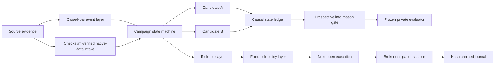

# RT Multi-Timeframe Quant Research

[](https://github.com/tangyunkai-hub/rt-multitimeframe-quant-research/actions/workflows/ci.yml)


A public-safe quantitative-research portfolio showing how a discretionary multi-timeframe Bitcoin framework was converted into a **causal, versioned, testable, and auditable research system**.

> **Current conclusion:** the frozen holdout failed. A separately frozen 2017–2022 external historical program produced heterogeneous evidence—BTC adverse to Candidate B, ETH supportive—and the same split persisted when execution/PnL moved from Binance to Coinbase. Candidate B remains a frozen prospective hypothesis, not validated alpha. Automated post-freeze data intake is now operational, but formal prospective evidence is still insufficient and performance remains embargoed.

## Why this project matters

The project is intentionally not presented as “a strategy with a high historical Sharpe.” Its main value is the research process:

**formalize → test invariants → diagnose concentration → freeze candidate → fail holdout → preserve failure → attribute mechanism → make one minimal change → embargo consumed data → preregister external/prospective validation → preserve contradictory evidence → harden data, risk, execution, reproducibility and paper operation**

| Evidence | Result |
|---|---:|
| Retrospective development return | **+257.9%** |
| Retrospective Sharpe | **~2.01** |
| Frozen holdout return | **-21.61%** |
| Frozen holdout Sharpe | **-1.15** |
| Frozen holdout max drawdown | **-38.02%** |
| External history BTC 2017–2022 | **Adverse to Candidate B** |
| External history ETH 2017–2022 | **Supportive of Candidate B** |
| Coinbase cross-exchange replication | **Same BTC/ETH directional split** |
| Post-freeze performance | **Embargoed / insufficient evidence** |

Negative and contradictory results are retained instead of being tuned away.

## Research architecture



Key design choices:

- confirmed higher-timeframe direction persists until an opposite confirmed event;
- local contrary evidence can degrade risk state without silently reversing direction;
- Long and Short permissions are not forced into mathematical symmetry;
- signals become actionable only after their source bars close;
- risk sizing cannot create directional permission;
- next-open execution is separated from signal generation;
- strategy permissions, risk sizing, execution and paper operation are separate layers;
- post-freeze performance is not released before the frozen information floor is met.

## Five-minute code-review path

1. **State-machine design** — [`src/rtquant/core/`](src/rtquant/core/)
2. **Prospective information gate** — [`src/rtquant/validation/`](src/rtquant/validation/)
3. **Risk-capital architecture** — [`src/rtquant/risk/`](src/rtquant/risk/)
4. **Causal execution** — [`src/rtquant/execution/`](src/rtquant/execution/)
5. **Single-writer paper session + audit journal** — [`src/rtquant/paper/`](src/rtquant/paper/)
6. **Reproducibility / SHA-256 manifests** — [`src/rtquant/repro/`](src/rtquant/repro/)
7. **Prospective operations runbook** — [`docs/prospective_operations.md`](docs/prospective_operations.md)
8. **Current research status** — [`docs/research_status.md`](docs/research_status.md)
9. **Tests** — [`tests/`](tests/)
10. **Technical paper** — [`research/RT_Quant_Research_Public_Technical_Paper.md`](research/RT_Quant_Research_Public_Technical_Paper.md)

For a recruiter-oriented summary, see [`docs/recruiter_guide.md`](docs/recruiter_guide.md).

## Evidence timeline

| Stage | Purpose | Status |
|---|---|---|
| Development | Rule formalization + retrospective diagnostics | Complete |
| Robustness | Temporal, campaign, parameter, cost, delay stress | Mixed |
| Frozen holdout | Test unchanged candidate | **FAIL** |
| Failure attribution | Explain failure without rescue tuning | Complete |
| Candidate B | One minimal permission change | Frozen, unvalidated |
| External history 2017–2022 | Older-regime BTC + ETH cross-asset replication | **Complete; heterogeneous** |
| Cross-exchange execution | Revalue frozen states on Coinbase | **Complete; venue-consistent** |
| Independent signal-source recreation | Exact native-clock replication | **Blocked by surveyed provider coverage** |
| Post-freeze native-data intake | Checksum-verified new-data collection | **Operational; data-only** |
| Prospective information floor | 180d + 3 Bear epochs + 6 divergences | **Insufficient** |
| Prospective performance | Frozen private evaluator only after floor | **Embargoed** |
| Long validation | Sparse-trend replication across Bull epochs | Protocol frozen |
| Risk sizing | Fixed defensive benchmark policies | **Architecture implemented; unvalidated** |
| Execution | Exact next-open causal wealth path | **Engineering hardened; parity-tested** |
| Paper shadow | Single-writer hash-chained brokerless operation | **Operationally runnable, not live** |
| Reproducibility | Collision-safe manifests + byte verification | **Hardened** |

## Candidate B

Candidate B changes exactly one public-facing permission concept: after a local Short structural invalidation, the same-level re-entry signal inside the same continuous Major Bear epoch is treated as **probe/diagnostic only** rather than automatically restoring core Short exposure.

It does **not** change higher-timeframe persistence, initial Short permission, Long permissions, higher-authority Long recovery, frozen thresholds, stop thresholds, the frozen risk-policy family, or the base transaction-cost convention.

Historical ablation, the 2017–2022 external program, and Coinbase execution replication are retrospective evidence only. Candidate B must still be judged on genuinely new data after its freeze boundary.

## External historical + cross-exchange robustness

The external evaluation protocol was frozen before reading 2017–2022 Candidate A/B performance.

- **BTC:** 26 divergence segments across 3 Major Bear divergence epochs; total paired delta log ≈ **-0.1701**; 1/3 epochs favor B; `ADVERSE_EXTERNAL_MECHANISM_EVIDENCE`.
- **ETH:** 20 divergence segments across 4 Major Bear divergence epochs; total paired delta log ≈ **+0.1482**; 3/4 epochs favor B; `EXTERNAL_MECHANISM_SUPPORT`.
- Fixed **0/2/5bp one-way slippage** stress does not change either qualitative label.
- Independent-epoch counts remain small, so no conventional statistical-significance claim is made.
- Revaluing the same frozen state paths on Coinbase preserved the BTC-adverse / ETH-supportive split at segment and Bear-epoch levels.

This is heterogeneous, execution-venue-robust historical evidence—not validated alpha and not prospective confirmation.

## Prospective operations

Candidate B freeze boundary: **2026-09-12T02:00:00Z**.

The `forward-native-data` workflow now performs checksum-verified Binance native data intake. Scheduled runs use a bounded `monitor` overlap; an explicit `full` mode rebuilds the complete frozen-forward pool. A latest dense source-day 404 is reported as `WAITING_SOURCE_ARCHIVE_PUBLICATION`, while an older missing dense archive fails closed. The workflow independently enforces that `performance_evaluation_allowed=false` and `candidate_b_judgement_allowed=false`.

The public command:

```bash
rtquant-prospective-gate --input runtime/candidate_b_forward_states.csv
```

counts only the frozen information floor. It intentionally exposes no threshold-override flags and always returns `performance=null`. The frozen floor is:

- at least **180 forward days**;
- at least **3 independent Major Bear divergence epochs**;
- at least **6 A/B divergence segments**.

Before all three are met it returns `KEEP_PERFORMANCE_EMBARGOED`. Once all three are met, the only authorization is `RUN_SEPARATELY_FROZEN_PRIVATE_V024_EVALUATOR`; the public CLI still does not calculate performance.

See [`docs/prospective_operations.md`](docs/prospective_operations.md) for the operational boundary between public data intake, private frozen state generation, information-floor counting and the brokerless paper journal.

## Risk, execution, paper and reproducibility safeguards

The public risk layer implements the frozen v0.26 architecture without publishing proprietary exact sizing recipes. It prevents the risk layer from creating directional permission, applies reductions once, keeps hedge reasons non-additive, and prevents defensive gross-cap logic from silently flipping direction.

The v0.27 execution layer uses an exact multiplicative wealth path: old exposure owns the gap to the next observed open, new exposure owns open-to-close, and transaction costs apply at the turnover event. Batch execution and the incremental paper runner are parity-tested.

The v0.28 paper layer is brokerless. `PaperSession` uses a single-writer lock, deterministic journal recovery, hash-chained append-only records, an append cursor, out-of-band journal-byte detection, lifecycle logging and idempotent equivalent retries. The installed command:

```bash
rtquant-paper ingest --journal runtime/candidate_b.paper.jsonl --input runtime/paper_bars.csv
rtquant-paper status --journal runtime/candidate_b.paper.jsonl
```

uses an output allowlist: equity, PnL, return, turnover and future performance-like fields are not released while the prospective embargo is active. There is no broker or live-order route.

Runtime forward data, state ledgers and paper journals are gitignored to reduce accidental publication. Run manifests independently verify current input bytes and manifest self-hashes.

The current combined engineering suite—including forward-data boundary tests, prospective embargo tests and paper CLI/session tests—passed on Python **3.10, 3.11 and 3.12** in CI run **`34703631551`**.

## Quick start

```bash
python -m venv .venv
source .venv/bin/activate
pip install -e '.[dev]'
pytest -q
python examples/run_synthetic_demo.py
```

Windows PowerShell activation:

```powershell
.venv\Scripts\Activate.ps1
```

The demo uses **synthetic data and generic events only**. It is not a trading signal generator and is not alpha evidence.

## Public/private boundary

Public:

- methodology and evidence governance;
- generic state-machine and risk architecture;
- causal timing and execution semantics;
- failed-holdout evidence;
- preregistered external historical evidence, including contradictory results;
- cross-exchange robustness evidence;
- prospective information-gate design and operational tooling;
- reproducibility and paper-audit tooling;
- synthetic tests and examples.

Not public:

- proprietary indicator construction;
- exact signal thresholds;
- private source notes / exports;
- exact internal timeframe-event labels;
- detailed sizing fractions;
- the frozen private v0.24 performance evaluator;
- broker credentials or live order routing.

## Read next

- [Prospective operations runbook](docs/prospective_operations.md)
- [Current research status](docs/research_status.md)
- [Recruiter / reviewer guide](docs/recruiter_guide.md)
- [External historical validation result](research/external_validation_results_2017_2022_2026-09-12.md)
- [Cross-exchange execution result](research/cross_exchange_execution_results_2017_2022_2026-09-12.md)
- [Signal-source replication feasibility](research/signal_source_replication_feasibility_2026-09-12.md)
- [Methodology](docs/methodology.md)
- [Architecture](docs/architecture.md)
- [Reproducibility](docs/reproducibility.md)
- [Technical paper](research/RT_Quant_Research_Public_Technical_Paper.md)

## Disclaimer

This repository is a research and portfolio artifact, not investment advice, a signal service, or a live trading system.
