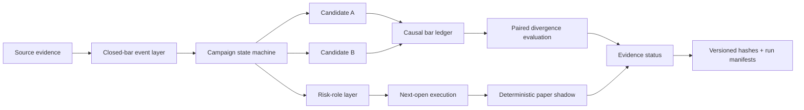

# RT Multi-Timeframe Quant Research

[](https://github.com/tangyunkai-hub/rt-multitimeframe-quant-research/actions/workflows/ci.yml)


A public-safe quantitative-research portfolio showing how a discretionary multi-timeframe Bitcoin framework was converted into a **causal, versioned, testable, and auditable research system**.

> **Current conclusion:** the frozen holdout failed. The post-holdout candidate is a prospective hypothesis, not validated alpha.

## Why this project matters

The project is intentionally not presented as “a strategy with a high historical Sharpe.” Its main value is the research process:

**formalize → test invariants → diagnose concentration → freeze candidate → fail holdout → preserve failure → attribute mechanism → make one minimal change → embargo consumed data → preregister prospective validation**

The retrospective development path looked strong, but the frozen holdout did not generalize:

| Evidence | Result |
|---|---:|
| Retrospective development return | **+257.9%** |
| Retrospective Sharpe | **~2.01** |
| Frozen holdout return | **-21.61%** |
| Frozen holdout Sharpe | **-1.15** |
| Frozen holdout max drawdown | **-38.02%** |

The negative result is retained in the repository instead of being tuned away.

## Research architecture



Key design choices:

- confirmed higher-timeframe direction persists until an opposite confirmed event;
- local contrary evidence can degrade risk state without silently reversing direction;
- Long and Short permissions are not forced into mathematical symmetry;
- signals become actionable only after their source bars close;
- next-open execution is separated from signal generation;
- strategy permissions, risk sizing, execution, and paper operation are separate research layers.

## Five-minute code-review path

If you are reviewing this as a quant researcher, engineer, or hiring manager, start here:

1. **State-machine design** — [`src/rtquant/core/`](src/rtquant/core/)
2. **Prospective A/B evaluation** — [`src/rtquant/validation/`](src/rtquant/validation/)
3. **Causal execution** — [`src/rtquant/execution/`](src/rtquant/execution/)
4. **Deterministic paper shadow** — [`src/rtquant/paper/`](src/rtquant/paper/)
5. **Reproducibility / SHA-256 manifests** — [`src/rtquant/repro/`](src/rtquant/repro/)
6. **Tests** — [`tests/`](tests/)
7. **Research status and unresolved gates** — [`docs/research_status.md`](docs/research_status.md)
8. **Technical paper** — [`research/RT_Quant_Research_Public_Technical_Paper.md`](research/RT_Quant_Research_Public_Technical_Paper.md)

For a recruiter-oriented summary, see [`docs/recruiter_guide.md`](docs/recruiter_guide.md).

## Evidence timeline

| Stage | Purpose | Status |
|---|---|---|
| Development | Rule formalization + retrospective diagnostics | Complete |
| Robustness | Temporal, campaign, parameter, cost, delay stress | Mixed |
| Frozen holdout | Test unchanged candidate | **FAIL** |
| Failure attribution | Explain failure without rescue tuning | Complete |
| Candidate B | One minimal permission change | Frozen, unvalidated |
| Prospective validation | New-data-only A/B comparison | Waiting for evidence |
| Long validation | Sparse-trend replication across Bull epochs | Protocol frozen |
| Risk sizing | Fixed defensive benchmark policies | Unvalidated |
| Execution | Next-open causal simulator | Built |
| Paper shadow | Deterministic brokerless replay | Built, not live |

## Candidate B — what changed

Candidate B changes exactly one public-facing permission concept: after a local Short structural invalidation, the same-level re-entry signal inside the same continuous Major Bear epoch is treated as **probe/diagnostic only** rather than automatically restoring core Short exposure.

What did **not** change:

- the higher-timeframe persistence rule;
- initial Short permission;
- Long permissions;
- higher-authority Long recovery logic;
- frozen indicator thresholds;
- stop thresholds;
- risk-allocation fractions;
- base transaction-cost convention.

Historical ablation is treated as diagnosis only. Candidate B must be judged on genuinely new data after its freeze boundary.

## Prospective validation gate

Candidate B is not eligible for formal judgement before all three conditions are met:

- at least **180 forward days**;
- at least **3 independent Major Bear divergence epochs**;
- at least **6 A/B divergence segments**.

The primary mechanism statistic is paired incremental log-return over intervals where Candidate A and B actually differ. Multiple re-entry attempts inside one continuous Bear epoch are not counted as independent replications.

## Quick start

```bash
python -m venv .venv
source .venv/bin/activate
pip install -e '.[dev]'
pytest -q
python examples/run_synthetic_demo.py
```

Windows PowerShell activation:

```powershell
.venv\Scripts\Activate.ps1
```

The demo uses **synthetic data and generic events only**. It is not a trading signal generator.

## Repository map

```text
src/rtquant/
  core/          generic campaign state machine + Candidate B abstraction
  io/            normalized-event schema validation
  validation/    paired A/B divergence evaluation
  execution/     next-open causal execution simulator
  paper/         idempotent paper-shadow runner
  repro/         SHA-256 run-manifest tooling

docs/            methods, architecture, status, recruiter review path
research/        public technical paper
examples/        synthetic bars/events only
tests/           unit + integration tests
.github/          CI workflow
```

## Public/private boundary

The private research tree contains source notes, exact indicator recipes, internal timeframe labels, and proprietary sizing experiments. This public repository deliberately abstracts those details while preserving enough structure to review the research method and software architecture.

Public:

- methodology and evidence governance;
- generic state-machine architecture;
- causal timing and execution semantics;
- failed-holdout evidence;
- prospective validation design;
- reproducibility and audit tooling;
- synthetic tests and examples.

Not public:

- proprietary indicator construction;
- exact signal thresholds;
- private source notes / exports;
- exact internal timeframe-event labels;
- detailed sizing fractions;
- broker credentials or live order routing.

## Read next

- [Recruiter / reviewer guide](docs/recruiter_guide.md)
- [Current research status](docs/research_status.md)
- [Portfolio landing page](docs/portfolio_landing.md)
- [Methodology](docs/methodology.md)
- [Architecture](docs/architecture.md)
- [Reproducibility](docs/reproducibility.md)
- [Public-release scope](docs/public_release_scope.md)
- [Technical paper](research/RT_Quant_Research_Public_Technical_Paper.md)
- [Interview brief](docs/interview_brief.md)

## Disclaimer

This repository is a research and portfolio artifact, not investment advice, a signal service, or a live trading system.
