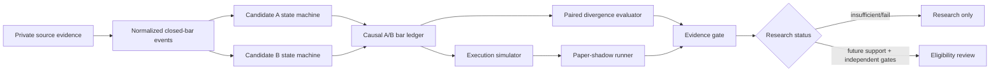

# Public Architecture

## Public/private boundary

The public repository begins at the **normalized event layer**. Exact proprietary indicator construction and signal thresholds remain private.

This boundary is deliberate: reviewers can audit causality, state authority, validation design, execution logic, and reproducibility without receiving the private trading recipe.
